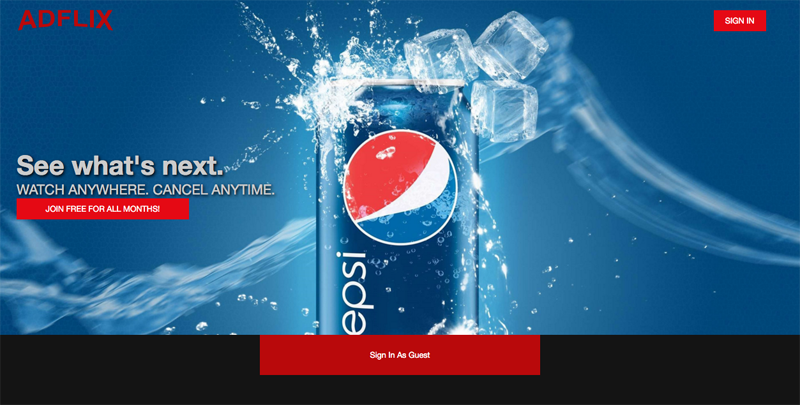
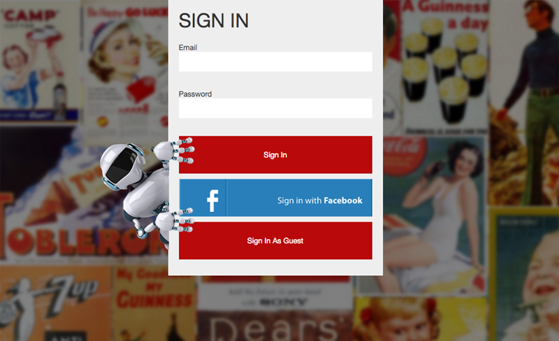
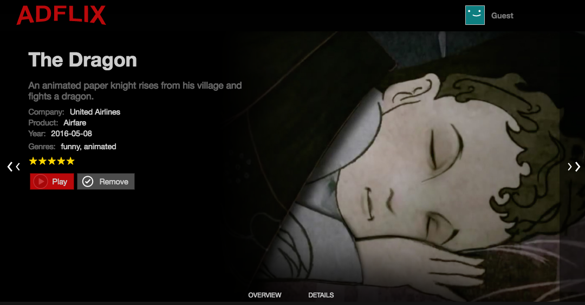
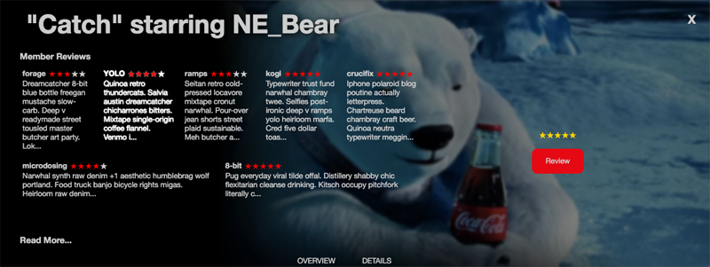
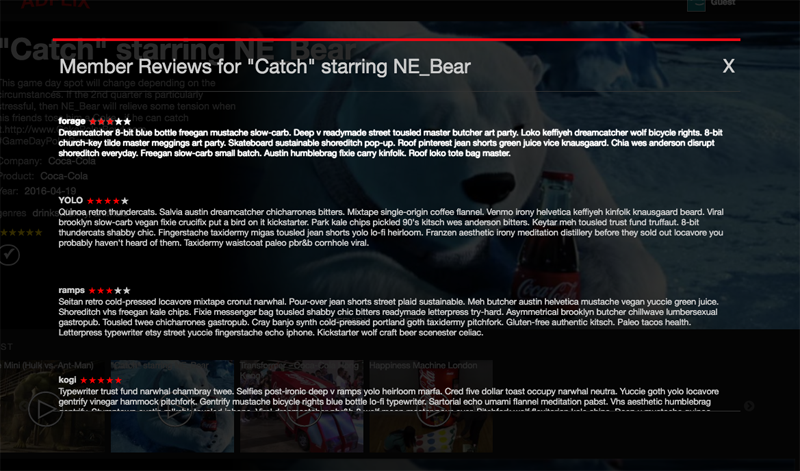
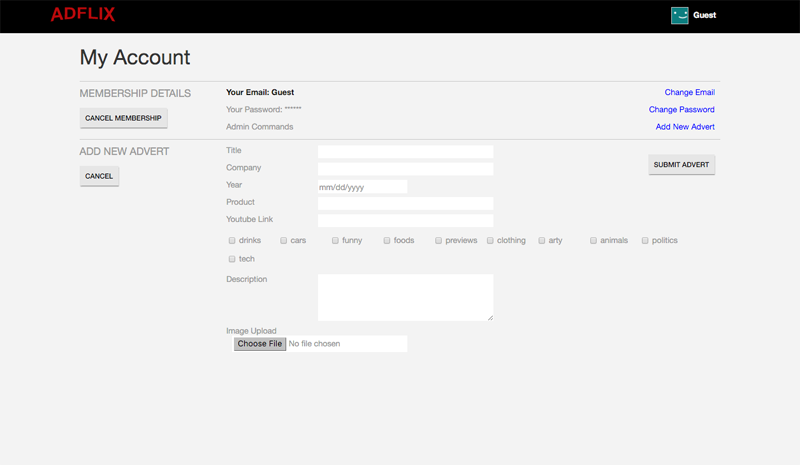
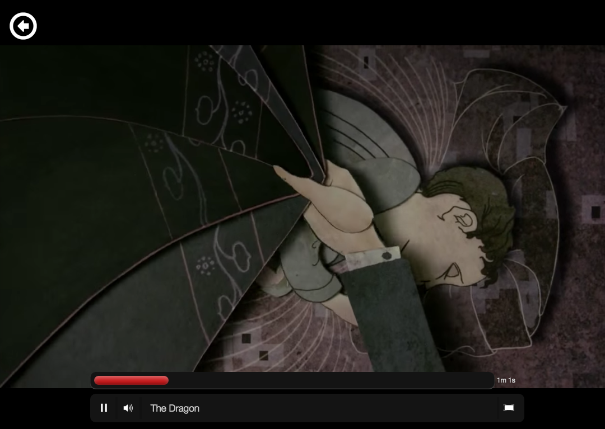

##**Adflixs**
Adflixs is a web application built to showcase video advertisements and track user interest in a Netflix inspired setup. It was built using Ruby on Rails, Javascript and React.

Click around at <a href='adflixs.herokuapp.com'>Adflixs Live</a>

###**Views**








###**Technical Details**
**Detail Expansion**
Probably the most complicated feature on the site is the Detail Panel. When you click on an advert, it expands it's parent component's row height by using a prop callback to trigger the expansion. This callback function had to make use of the row's ID to determine which one to expand. It also had to tell all of the other rows that might have open details already to close.
```
// Update the Store with the last row that was clicked, as the same ad can
// exist in multiple rows, Row is listening for changes.
sendBackID: function (e) {
  e.preventDefault();
  ApiUtil.fetchAdvert(this.props.ad.id, this.props.rowID);
},

//
checkDetails: function() {
  if (AdStore.getAd() === null) {
    this.setState({ showDetail: false });
  } else if (AdStore.getAd().rowID === this.props.genre.id){
    this.setState({
      showDetail: true
    });
  } else if (this.state.showDetail) {
    this.setState({ showDetail: false });
  }
},
```

**Infinite Scroll**
There was some hang time with the initial database query due to the time it took to render all of the JSON. To improve this I implemented pagination with the kaminari gem.
```
def index
  @page = params[:page].to_i || 1
  genre_records = Genre.all.page(@page)
  @page_count = genre_records.num_pages
  @genres = genre_records.includes(:ads)
end
```
To trigger the pagination, I added an on scroll event triggered by scrolling to the bottom of the page. The event loads the next three rows, and will continue to do so until the original query is fully displayed. I also added a throttle callback to prevent the event from firing off more times then desired.
```
handleScroll: function (e) {
  if (this.waiting) return;

  if ((window.innerHeight + window.scrollY + 10) >= document.body.offsetHeight) {
    this.getMoreRows();
    this.waiting = true;
  }
},

//throttles Scroll Event
timeoutCallback: function () {
  setTimeout(function(){ this.waiting = false; }.bind(this), 500);
},

getMoreRows: function () {
  var page = GenreStore.getCurrentPage();
  if ( page >= GenreStore.getLastPage() ) {
    $(window).unbind('mousewheel');
  } else {
    ApiUtil.fetchGenres(page++, this.timeoutCallback);
  }
},
```
**My List**
When Implementing MyList towards the end of the project I was reusing the row and row item components to generate its DOM. Those were originally created dynamically and required a very specific information to function and not break any of the other features that relied on them. To build another component, or write in a bunch of exceptions through a passed down prop would require a lot of work and be ugly after. I solved this by packaging the information in a way that could play nice with all of the pre-exiting code, including the multiple flux cycles involved.

```
fetchMyList: function () {
  if (this.state.myList.length === 0) return;
  myListPackage = {
    name: "My List",
    id: "My List",
    ads: this.state.myList
  };
  return (
    <AdvertRow genre={myListPackage}/>
  );
},
```

**Streaming Content**
I decided to use youtube to host and stream my video content, and they provide a very simple API for setting this up. I had the standard image resize dynamically depending on the window screen.
```
handleResize: function(e) {
  this.setState({windowWidth: window.innerWidth});
},

render: function() {
  var youtubeLink = this.props.location.query.youtube;
  var width = this.state.windowWidth * 0.8;
  var height = width * 0.64;
  return (
    <div className="video-main-container">
      <iframe
        width={ width }
        height={ height }
        src={"https://www.youtube.com/embed/" + youtubeLink}
        frameBorder="0" allowFullScreen></iframe>
    </div>
  );
}
```
To get the right information here I used the query string in the url. This was planted in a play button on the individual adverts.
```
playAd: function (e) {
  e.preventDefault();
  e.stopPropagation();
  this.context.router.push({
    pathname: "/main/streaming",
    query: { youtube: this.props.ad.youtube }
  });
},
```
**Reviews**
When reviewing adverts in the Detail pane, it provides a list of the last eight reviews for display. These also show the individual score given by each of the reviewers. The first time a user reviews an advert, the form field is blank, but each subsequent time it brings up the users previous review for edit instead.
```
reviewForm: function () {
  var view = this.checkCurrentUser();
  if (this.state.show === "none") {
    return (
      <section className="ad-review-flex-button ad-review-right-panel">
        <RateStars ad={this.props.ad}/>
        <button className="ad-review-button" onClick={this.showForm}>
          Review</button>
      </section>
    );
  } else if (this.state.show === "form") {
    return (
      <section className="ad-review-flex-form ad-review-right-panel">
        <form onSubmit={this.sendReview} ref="UpdateForm"
          className="review-form-flex-container">
          <label>Title
            <input type="text" name="title" defaultValue={view.title}
              className="form-review-input"/>
          </label>
          <label>Review
            <textarea name="review" defaultValue={view.review}
              className="form-review-input form-review-area" />
          </label>
          <div className="button-flex-form-container">
            <input className="ad-review-button" type="submit" value="Submit"/>
            <RateStars ad={this.props.ad}/>
            <button className="ad-review-cancel" onClick={this.closeForm}>
              Cancel</button>
          </div>
        </form>
      </section>
    );
  }
},
```
**Rating**
The stars were perhaps one of the more dynamic features of the site. They default to the average rating of all of the reviews given to the advert in red, but become overwritten by the users own rating, in gold. The stars light up gold or dulled out on mouse over events, and return to their normal state on mouse off. Users can dynamically re-rate adverts and it will update in live-time anywhere the stars can be seen.
```
render: function() {
  var one, two, three, four, five;
  if (this.state.rate === 0 || !this.state.rate) {
    if (this.props.ad.average) {
      one = this.props.ad.average > 0 ? " review-star" : "";
      two = this.props.ad.average > 1 ? " review-star" : "";
      three = this.props.ad.average > 2 ? " review-star" : "";
      four = this.props.ad.average > 3 ? " review-star" : "";
      five = this.props.ad.average > 4 ? " review-star" : "";
    }
  } else {
    one = this.state.rate > 0 ? " gold" : "";
    two = this.state.rate > 1 ? " gold" : "";
    three = this.state.rate > 2 ? " gold" : "";
    four = this.state.rate > 3 ? " gold" : "";
    five = this.state.rate > 4 ? " gold" : "";
  }
  return (
    <ul className="rating-features" onMouseLeave={this.setStarsFromStore}>
      <div className={"rate" + one} name="1"
        onMouseEnter={this.makeGold} onClick={this.rate}>&#x2605;</div>
      <div className={"rate" + two} name="2"
        onMouseEnter={this.makeGold} onClick={this.rate}>&#x2605;</div>
      <div className={"rate" + three} name="3"
        onMouseEnter={this.makeGold} onClick={this.rate}>&#x2605;</div>
      <div className={"rate" + four} name="4"
        onMouseEnter={this.makeGold} onClick={this.rate}>&#x2605;</div>
      <div className={"rate" + five} name="5"
        onMouseEnter={this.makeGold} onClick={this.rate}>&#x2605;</div>
    </ul>
  );
)
```
This got complicated when it came from shifting from design panes within the same row, as parts of the state got out of sync with each other. This was a rather stubborn bug. To solve this, I learned the many react life cycles and updated the state of the current object using the props being passed in.
```
componentWillReceiveProps: function (nextProps) {
  this.setState({ rate: SessionStore.fetchView(nextProps.ad.id).rate });
},
```

###**Features**
* Watch Streaming Commercials
* Login using Oauth: Facebook
* Peruse Ads through sorted carousel rows
* Infinite Scrolling
* See the average rating for a particular Ad
* Provide your own rating for a particular Ad
* Read and Review Ads
* Customize your favorite ads on your MyList row
* Submit new Ads into the Site ( intended to be for admin )

###**To-Do**
- [x] Make Facebook login interchangeable with an Account login.
- [ ] Finish Implementing Google Oauth
- [ ] Implement Full Search Functions
- [ ] Implement Viewing History and Statistics within Account Details
- [ ] Implement Recently Watched / Watch Again Rows
- [ ] Implement Most Watched / Popular Ad Rows
- [ ] Implement Fluid CSS Transitions for Un/Mounting Components
- [ ] Rebuild and Improve ReactSlick Carousel
- [ ] Add Rich Text formatting into Ad Reviews
- [ ] Revisit CSS for multimedia and universal Browser Compatibility
